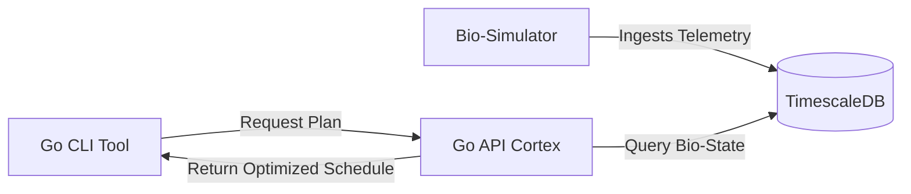

# TardiGo: Biological Task Scheduler
TardiGo is a distributed system that schedules tasks based on your **biological capacity** rather than just clock time. It implements the **Borbély Two-Process Model** of sleep regulation to simulate human fatigue and assigns high-effort tasks to mathematically optimal productivity windows.

**Link to project:** http://recruiters-love-seeing-live-demos.com/


## How It's Made:

**Tech used:** Go (Golang), TimescaleDB (PostgreSQL), Docker, Docker Compose, REST APIs.

The system is built as a distributed microservices architecture to mimic a biological system:

1.  **The Nervous System (Simulator):** A background Go service that mathematically models fatigue. It calculates **Process S** (Homeostatic Sleep Pressure) using exponential decay functions and **Process C** (Circadian Rhythm) using sinusoidal oscillators. It writes this telemetry to the database in real-time.
2.  **The Memory (TimescaleDB):** A PostgreSQL database optimized for time-series data. It stores the biological metrics (HRV, Sleep Pressure) allowing the system to query historical and predicted future states.
3.  **The Cortex (API & Scheduler):** A REST API that acts as the decision engine. It ingests a list of tasks (weighted by cognitive load 1-10) and uses a **Greedy Heuristic Algorithm** to map the hardest tasks to the highest capacity windows available.



## Optimizations

One of the biggest challenges was handling the sheer volume of "biological time" data efficiently.

1.  **TimescaleDB Hypertables:** Instead of a standard SQL table, I utilized TimescaleDB's Hypertables. This automatically partitions the biological telemetry data by time chunks. This makes range queries (e.g., "Predict my capacity for the next 12 hours") significantly faster than a standard B-Tree index, ensuring the scheduler returns results in milliseconds even as data grows.
2.  **Greedy Heuristic Scheduling:** The scheduling problem is NP-hard. To optimize for performance, I implemented a greedy heuristic that sorts tasks by Effort Level (Descending). It prioritizes placing "Deep Work" (Level 9-10) tasks into "Prime Time" slots first, ensuring that high-value cognitive resources aren't wasted on low-value tasks like email.

## Lessons Learned:

Building TardiGo forced me to bridge the gap between abstract neuroscience and concrete software engineering.

1.  **Translating Math to Code:** Implementing the Borbély Two-Process Model required translating differential equations into Go structs. I learned how to model exponential decay (Process S) not just as a math concept, but as a computable function that updates over time.
2.  **Docker Networking:** I initially struggled with communication between the CLI and the Dockerized API due to Windows IPv6/IPv4 conflicts ([::1] vs 127.0.0.1). Debugging this taught me a lot about how Docker exposes ports and handles local loopback addresses.
3.  **Tooling Matters:** Initially, I tested the API with raw JSON strings. I realized this was poor UX, so I built a custom CLI Tool using Go's flag and text/tabwriter packages. This turned a "backend experiment" into a usable "product" that I can run from my terminal daily.

## Usage Examples:

**1. Wake Up the System**

```bash
docker-compose up -d
```

**2. Check Your "Brain Battery**

```bash
./tardigo.exe status
```

**3. The "Burnout Prevention" Test**

```bash
./tardigo.exe plan "Write Kernel Module" 60 9
```

Observation: TardiGo will refuse to book this now. It scans the future and finds a slot (e.g., 10:00 AM) where your predicted capacity is >85%, protecting you from working when inefficient.

## Roadmap

[ ] Integration with Apple Health / Oura Ring webhooks for real biological data.

[ ] "Cryptobiosis Mode": Automatic schedule clearing when HRV drops below panic thresholds.


